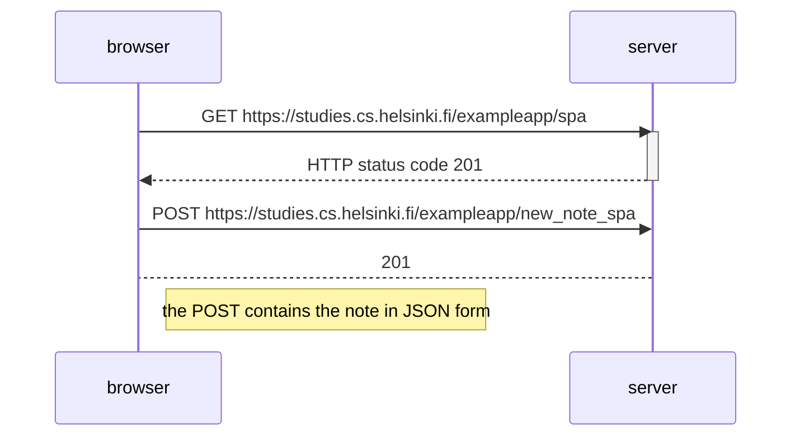

```mermaid 
sequenceDiagram
participant browser 
participant server

browser->>server: GET https://studies.cs.helsinki.fi/exampleapp/spa 
activate server 

server-->>browser: HTTP status code 201
deactivate server 

browser->> server: POST https://studies.cs.helsinki.fi/exampleapp/new_note_spa
server--> browser:  201
note right of browser: the POST contains the note in JSON form
 
``` 