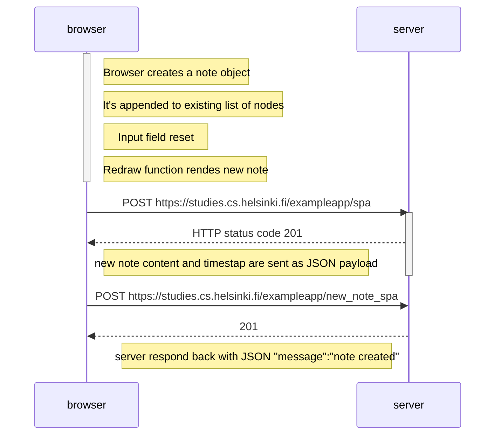

```mermaid 
sequenceDiagram
participant browser 
participant server
activate browser

note right of browser: Browser creates a note object  
note right of browser: It's appended to existing list of nodes
note right of browser: Input field reset
note right of browser: Redraw function rendes new note
deactivate browser

browser->>server: POST  https://studies.cs.helsinki.fi/exampleapp/spa 
activate server 
server-->>browser: HTTP status code 201
note right of browser: new note content and timestap are sent as JSON payload
deactivate server 

browser->> server: POST https://studies.cs.helsinki.fi/exampleapp/new_note_spa
server-->> browser:  201
note left of server : server respond back with JSON  "message":"note created"
 
``` 