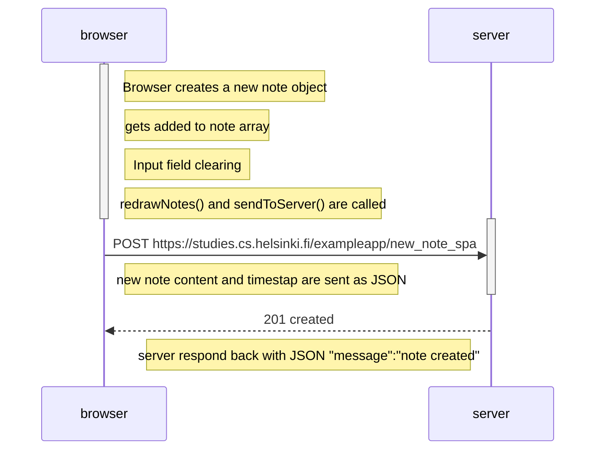

```mermaid 
sequenceDiagram
participant browser 
participant server
activate browser

note right of browser: Browser creates a new note object  
note right of browser: gets added to note array
note right of browser: Input field clearing
note right of browser: redrawNotes() and sendToServer() are called
deactivate browser

activate server 


browser->> server: POST https://studies.cs.helsinki.fi/exampleapp/new_note_spa

note right of browser: new note content and timestap are sent as JSON 
deactivate server 

server-->> browser:  201 created 

note left of server : server respond back with JSON  "message":"note created"
 
``` 